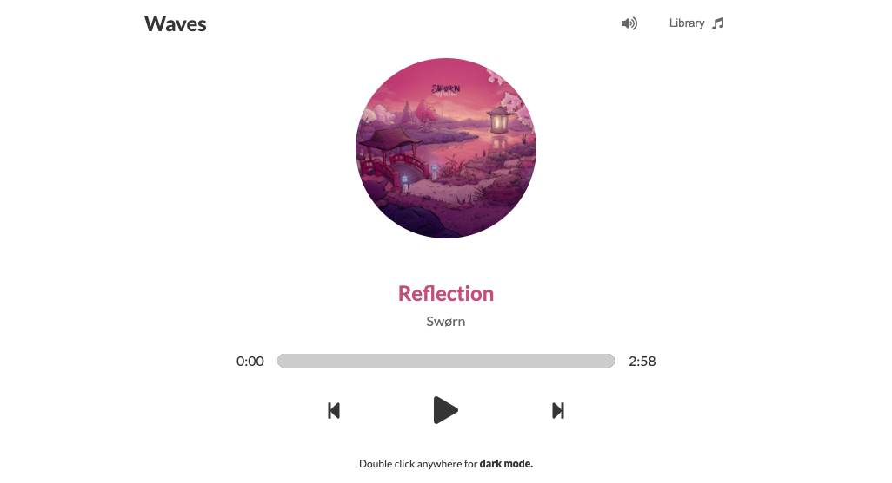
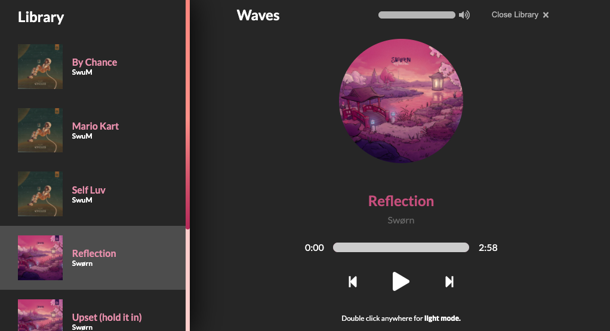

# Waves

 

This project was created using Dev Ed's [The Creative React and Redux Course](https://developedbyed.com/p/the-creative-react-and-redux-course) and was intended as a learning exercise. Some additional functionality was added but the majority of it can be built using this course's guidance. Incredible tutor, highly recommended.

## Installation

After cloning the project, `npm install` to install all the dependencies and then `npm start` to view the project in development mode. No extra technologies/databases/3rd-part-APIs needed.

## Technologies

This project was boostrapped using create-react-app and uses sass for styling. The is a very minor use of animate.css but can be removed without any noticeable changes.

## Preview

## Future todo
* [ ] Transition between audio on and off (rather than abruptly move from one to the other)
* [ ] Allow users to add new tracks/access a 3rd-party API for music
* [ ] Prevent dark/light mode swap when elements are clicked
* [ ] Optimise for phone/tablet

### Where is your commit history?
Completely ignored. I stupidly didn't commit throughout the project because I never thought I'd upload this to the public. If I any anything further, will definitely make more commits.

### Contributions?
This is just a learning exercise so absolutely feel free to contribute whatever you like!
